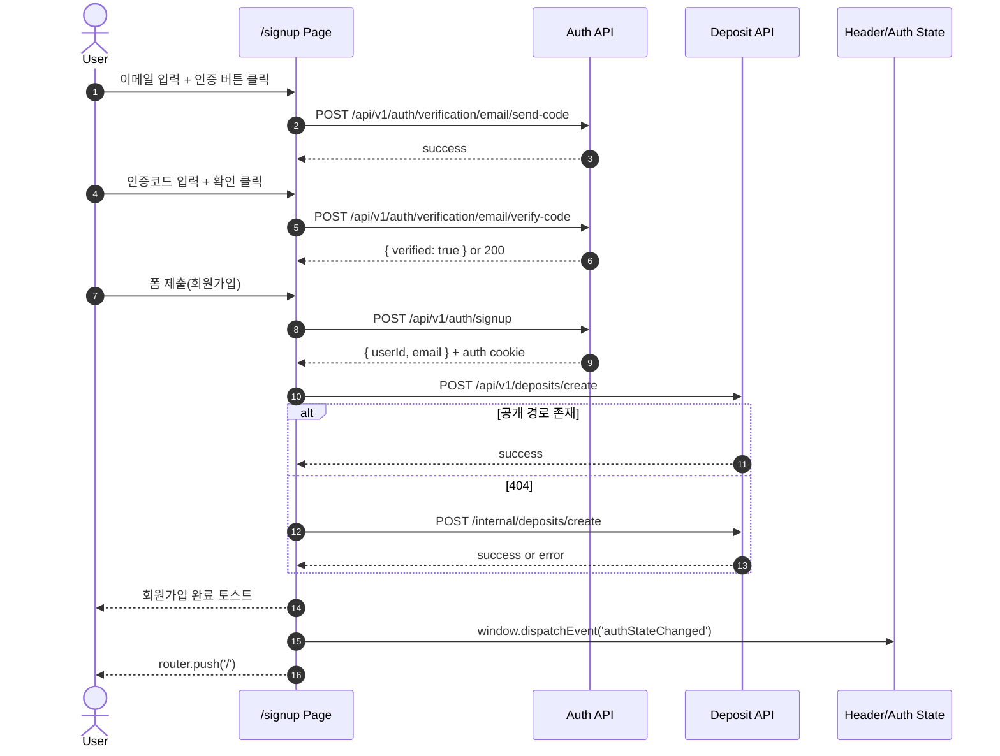

# Signup Sequence + QA Checklist

## Sequence Diagram

## 상태 전이 요약

| 상태 | 진입 조건 | 이탈 조건 |
| --- | --- | --- |
| `Idle` | `/signup` 최초 진입 | 이메일 입력/인증 시도 |
| `VerificationRequested` | 인증코드 발송 성공 | 코드 검증 성공/실패 |
| `Verified` | 코드 검증 성공 | 이메일 필드 변경(초기화) |
| `Submitting` | 회원가입 제출 클릭 | 가입 API 성공/실패 |
| `Completed` | 가입 성공 + 홈 이동 | 일반 로그인 세션 상태로 전환 |

## QA 체크리스트

| ID | 시나리오 | 기대 결과 |
| --- | --- | --- |
| SGN-01 | 이메일 없이 인증 버튼 클릭 | API 미호출, 오류 토스트 노출 |
| SGN-02 | 잘못된 이메일 형식 입력 후 인증 | API 미호출, 형식 오류 토스트 |
| SGN-03 | 인증코드 발송 성공 | 코드 입력 영역 노출 |
| SGN-04 | 잘못된 인증코드 입력 | 인증 실패 토스트, `Verified` 미전환 |
| SGN-05 | 인증 성공 후 이메일 필드 수정 | 인증 상태 초기화(`isEmailVerified=false`) |
| SGN-06 | 비밀번호/확인 불일치 | 가입 API 미호출, 오류 토스트 |
| SGN-07 | 중복 이메일(409) 가입 시도 | "이미 사용 중인 이메일" 토스트 |
| SGN-08 | 공개 예치금 엔드포인트 404 | internal fallback 호출 수행 |
| SGN-09 | 예치금 생성 실패 | 가입 성공 유지 + 홈(`/`) 이동 |
| SGN-10 | 가입 성공 | `authStateChanged` 이벤트 발생 + 홈(`/`) 이동 |

## 보안/정합성 규칙

- 예치금 생성 API 요청 body에 `userId`를 넣지 않는다.
- 사용자 식별은 인증 컨텍스트(쿠키/헤더)로 서버에서 추출한다.
- 로컬 게이트웨이 인증 정책이 쿠키를 수용하지 않으면 2차 호출만 실패할 수 있으며, 가입 성공 자체는 유지한다.
